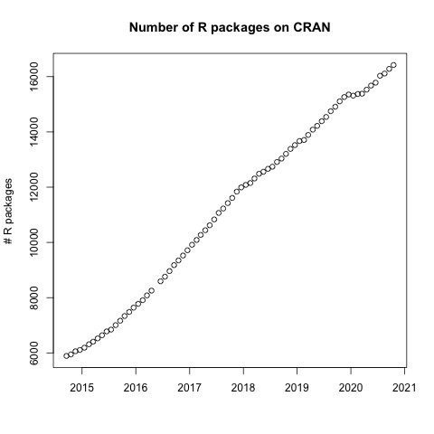

> ## Learning Objectives {.objectives}
>
> * To be able to install R packages
>

```{r, include=FALSE}
source("tools/chunk-options.R")
```


## R Packages

It is possible to add functions to R by writing a package, or by
obtaining a package written by someone else. As of this writing, there
are over 16,000 packages available on [CRAN (the comprehensive R archive
network)](https://www.r-project.org). Their number increases every day:



R and RStudio have functionality for managing packages:

* You can see what packages are installed by typing
  `installed.packages()`
* You can install packages by typing `install.packages("packagename")`,
  where `packagename` is the package name, in quotes.
* You can update installed packages by typing `update.packages()`
* You can remove a package with `remove.packages("packagename")`
* You can make a package available for use with `library(packagename)`

Install and load the `data.table` package:

```{r, eval=FALSE}
install.packages("data.table")
library(data.table)
```


Packages can also be viewed, loaded, and detached in the Packages tab of the lower right panel in RStudio. Clicking on this tab will display all of installed packages with a checkbox next to them. If the box next to a package name is checked, the package is loaded and if it is empty, the package is not loaded. Click an empty box to load that package and click a checked box to detach that package.

Packages can be installed and updated from the Package tab with the Install and Update buttons at the top of the tab.

