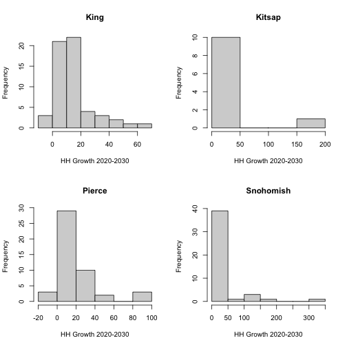

> ## Challenge 1 {.challenge}
>
> The `paste` function can be used to combine text together, e.g:
>
> 
> ~~~{.r}
> best_practice <- c("Write", "programs", "for", "people", "not", "computers")
> paste(best_practice, collapse=" ")
> ~~~
> 
> 
> 
> ~~~{.output}
> [1] "Write programs for people not computers"
> 
> ~~~
>
>  Write a function called `fence` that takes two vectors as arguments, called
> `text` and `wrapper`, and prints out the text wrapped with the `wrapper`:
>
> 
> ~~~{.r}
> fence(text = best_practice, wrapper = "***")
> ~~~
> 
> 
> 
> ~~~{.output}
> [1] "*** Write programs for people not computers ***"
> 
> ~~~
>
> *Note:* the `paste` function has an argument called `sep`, which specifies the
> separator between text. The default is a space: " ". The default for `paste0`
> is no space "".
>

> ## Challenge 2 {.challenge}
> Can you write a `for` loop that reproduces the following 4-panel plot of growth rate 
> from 2020 to 2030 for the four counties?
>
> 
> _Hint_: See the [Saving Plots](01-more-plots.html#saving-plots) section on creating a 2x2 graph panels.
> 

> ## Challenge 3 {.challenge}
>
> Install the following packages: `ggplot2`, `dplyr`, `data.table`
>
